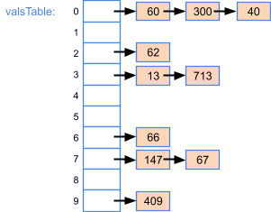
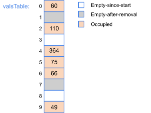

### HashTable
- **Type:** data structure
- **Implements:** Dictionary
- **Backend data structure:** array
- When mapped to a hash table, each element will be given a **key** by a **hash function**, and be assigned to a **bucket** with specific index.  
if a==b, h(a) = h(b)  
if a!= b, it's ok h(a) = h(b) -> collision  
- **Collision**: An item being inserted into a hash table maps to the same bucket as an existing item in the hash table.  
To solve collision, there are 2 methods.  
- **Chaining**  
   - **Runtime complexity** | *worst:* **O(N)** | *average:* **O(1+α)**  where α is load factor
     
       
     Use a **linked list** for each bucket.  
   - Insert:  
      ```
      HashInsert(hashTable, item) {
         if (search(hashTable, item.key) == null) {
            bucketList = hashTable[Hash(item.key)]
            node = Allocate new linked list node
            node.next = null
            node.data = item
            ListAppend(bucketList, node)
         }
      }
      ```
   - Remove:  
      ```
      HashRemove(hashTable, item) {
         bucketList = hashTable[Hash(item.key)]
         itemNode = search(bucketList, item.key)
         if (itemNode != null) {
            ListRemove(bucketList, itemNode)
         } 
      }
      ```
   - Search:  
      ```
      HashSearch(hashTable, key) {
         bucketList = hashTable[Hash(key)]
         itemNode = ListSearch(bucketList, key)
         if (itemNode != null)
            return itemNode.data
         else
            return null
      }
      ```

- **2. Linear probing**  
   - **Runtime complexity**: *worst:* **O(N)** || *average:* **O(1+α)**  

        
   - Insert:  
      ```
      Hashinsert(hashTable, item) {
         // Hash function determines initial bucket
         bucket = Hash(item.key)    
         bucketsProbed = 0
         N = hashTable's size
         while (bucketsProbed < N) {
            // Insert item in next empty bucket
            if (hashTable[bucket] is Empty) {
               hashTable[bucket] = item
               return true 
            }
            // Increment bucket index
            bucket = (bucket + 1) % N
            // Increment number of buckets probed
            ++bucketsProbed
         }
         return false      
      }
      ```
   - Search:  
      ```
      HashSearch(hashTable, key) {
         // Hash function determines initial bucket
         bucket = Hash(key)
         bucketsProbed = 0
         while ((hashTable[bucket] is not EmptySinceStart) and
               (bucketsProbed < N)) {
            if ((hashTable[bucket] is not Empty) and
               (hashTable[bucket].key == key)) {
               return hashTable[bucket]
            }
            // Increment bucket index
            bucket = (bucket + 1) % N
            // Increment number of buckets probed
            ++bucketsProbed
         }
         return null  // Item not found
      }
      ```

- **Resize**
   - Expand the length of the array after hitting **load factor**, and re-assign each element in the old array to the new array.  
      ```
      HashResize(hashTable, currentSize) {
         newSize = nextPrime(currentSize * 2)
         newArray = Allocate new array of size newSize
         Set all entries in newArray to EmptySinceStart
         bucket = 0
         while (bucket < currentSize) {
            if (hashTable[bucket] is not Empty) {
               key = hashTable[bucket]
               HashInsert(newArray, key)
            }
            bucket = bucket + 1
         }
         return newArray
      }
      Hash(key, tableSize) {
         return key % tableSize
      }
      ```

- **Disadvantages of HashTable:**  
   - Takes extra space  
   - Can not sort
