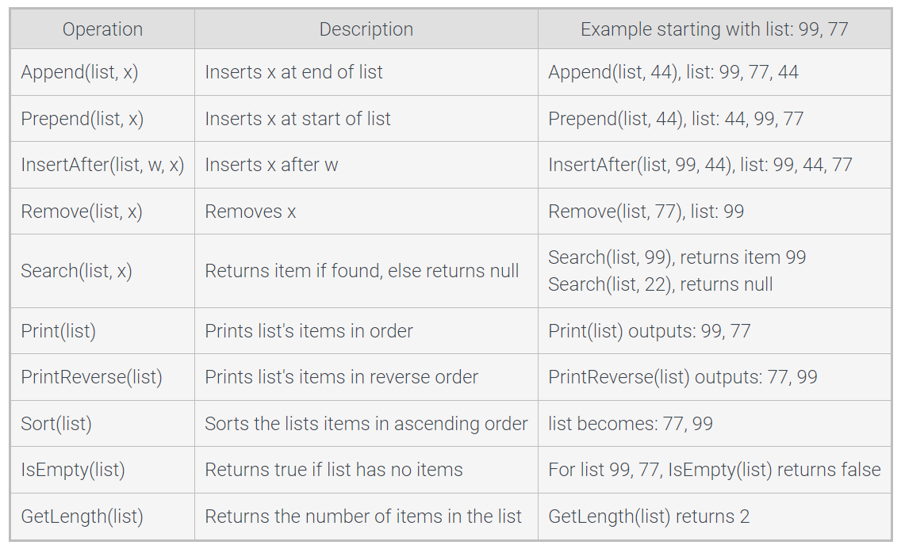

### List
- **Type:** ADT
- **Comman operations:**  


### ArrayList
- **Type:** data structure
- **Implements:** List
- **Underlying data structure:** array
- **Instance:** `Object[] array`, `int length`
- **Methods:**
  - Note: **length** = the number of valid elements in the array; **array.length** = the capacity of the array.
  - Resize
    ```
    ListResize(list, newCapacity) {
       newArray = new Object[newCapacity]
       Copy all elements from list.array to newArray
       list.array = newArray
    }
    ```
  - Append
    ```
    ListAppend(list, newItem) {
       if (list.array.length == list.length) {
          ListResize(list, list.length * 2)
       }
       list.array[list.length] = newItem
       list.length = list.length + 1
    }
    ```
  - Prepend
    ```
    ListPrepend(list, newItem) {
        if (list.array.length == list.length) {
            ListResize(list, list.length * 2)
        }
        // Shift every element one index right
        for (i = list.length; i > 0; i--) {
            list.array[i] = list.array[i - 1]
        }
        list.array[0] = newItem
    }
    ```
  - InsertAfter
    ```
    ListInsertAfter(list, index, newItem) {
        if (list.array.length == list.length) {
            ListResize(list, list.length * 2)
        }
        // Shift every element after the given index one index right
        for (i = list.length; i > index + 1; i--) {
            list.array[i] = list.array[i - 1]
        }
        list.array[index + 1] = newItem
        list.length = list.length + 1
    }
    ```
  - Search
    ```
    ListSearch(list, item) {
       for (i = 0; i < list.length; i++) {
          if (list.array[i] == item) {
             return i
          }
       }
       return -1 // not found
    }
    ```
  - RemoveAt
    ```
    ListRemoveAt(list, index) {
       if (index >= 0 && index < list.length) {
          // Shift every element from given index one index left
          for (i = index; i < list.length - 1; i++) {
             list.array[i] = list.array[i + 1]
          }
          list.length = list.length - 1
       }
    }
    ```

### Singly-linked list (dummy node at head)
- **Type:** data structure
- **Implements:** List
- **Underlying data structure:** N/A
- **Nested class:** `Node`
  - **Nested instance:** `Node next`, `E data`
- **Instance:** `Node head`, `Node tail`, `int size`
- **Methods:**
    - Append
      ```
      ListAppend(list, newNode) {
          // When list is empty
         if (list.head.next == null) {
            list.head.next = newNode
            list.tail = newNode
         } else {
            list.tail.next = newNode
            list.tail = newNode
         }
      }
      ```
    - Prepend
      ```
      ListPrepend(list, newNode) {
          // When list is empty
         if (list.head.next == null) {
            list.head.next = newNode
            list.tail = newNode
         }
         else {
            newNode.next = list.head.next
            list.head.next = newNode
         }
      }
      ```
    - InsertAfter
      ```
      ListInsertAfter(list, curNode, newNode) {
          // When list is empty
         if (list.head.next == null) { 
            list.head.next = newNode
            list.tail = newNode
         }
          // When curNode is tail
         else if (curNode == list.tail) { 
            list.tail.next = newNode
            list.tail = newNode
         }
         else {
            newNode.next = curNode.next
            curNode.next = newNode
         }
      }
      ```
    - RemoveAfter
      ```
      ListRemoveAfter(list, curNode) {
         // If curNode is null - remove the first element (special case)
         if (curNode == null && list.head.next != null) {
            sucNode = list.head.next
            list.head.next = sucNode
            // If removed tail
            if (sucNode == null) {
               list.tail = null
            }
         }
         else if (curNode.next != null) {
            sucNode = curNode.next.next
            curNode.next = sucNode
            // If removed tail
            if (sucNode == null) { 
               list.tail = curNode
            }
         }
      }
      ```
    - Traverse: loop
      ```
      ListTraverse(list) {
         curNode = list.head.next // Start at head
         while (curNode != null) { 
            Print curNode's data
            curNode = curNode.next
         }
      }
      ```
    - Traverse: recursive
      ```
      ListTraverse(list) {
         ListTraverseHelper(list.head.next)
      }
      
      ListTraverseHelper(node) {
         if (node != null) {
            Visit node
            ListTraverseHelper(node.next)
         }
      }
      ```
    - Search
      ```
      ListSearch(list, key) {
         return ListSearchHelper(key, list.head.next)
      }
      
      ListSearchHelper(key, node) {
         if (node != null) {
            if (node.data == key) {
               return node
            }
            return ListSearchHelper(key, node.next)
         }
         return null
      }
      ```

### Doubly-linked list (dummy node at both ends)
- **Type:** data structure
- **Implements:** List
- **Underlying data structure:** N/A
- **Nested class:** `Node`
  - **Nested instance:** `Node next`, `Node prev`, `E data`
- **Instance:** `Node head`, `Node tail`, `int size`
- **Methods:**
  - Append
    ```
    ListAppend(list, newNode) {
       if (list.head.next == null) { // List empty
          list.head.next = newNode
          list.tail.prev = newNode
       }
       else {
          list.tail.prev.next = newNode
          newNode.prev = list.tail.prev
          list.tail.prev = newNode
          newNode.next = list.tail
       }
    }
    ```
  - Prepend
    ```
    ListPrepend(list, newNode) {
       if (list.head.next == null) { // List empty
          list.head.next = newNode
          list.tail.prev = newNode
       }
       else {
          newNode.next = list.head.next
          list.head.next.prev = newNode
          list.head.next = newNode
          newNode.prev = head
       }
    }
    ```
