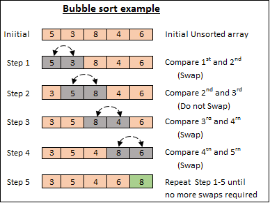
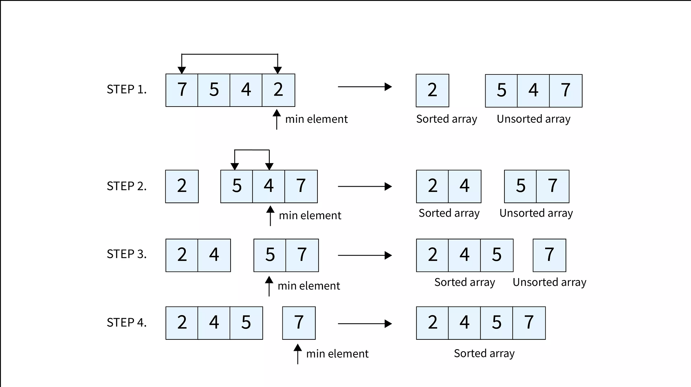

### Bubble Sort
- Iterates through a list, comparing and swapping adjacent elements if the second element is less than the first element. Keep doing it until no swap happens in an iteration.  

```
BubbleSort(array, size) {
  for (i = 0; i < size - 1; i++) {
    for (j = 0; j < size - i - 1; j++) {
      if (array[j] > array[j+1]) {
        // Swap
        temp = array[j]
        array[j] = array[j + 1]
        array[j + 1] = temp
      } 
    }
  }
}
```
- **Runtime:** *all cases:* **O(N^2)**  
  *Outer loop:* **N** | *Inner loop:* **N-1** | *Total:* **N(N-1)**

### Selection Sort
-  Treats the input as two parts, a sorted part and an unsorted part, and repeatedly selects the proper next value to move from the unsorted part to the end of the sorted part.  

```
SelectionSort(array, size) {
   i = 0
   j = 0
   indexSmallest = 0
   temp = 0  // Temporary variable for swap
   
   for (i = 0; i < size - 1; ++i) {
      
      // Find index of smallest remaining element
      indexSmallest = i
      for (j = i + 1; j < size; ++j) {
         
         if ( array[j] < array[indexSmallest] ) {
            indexSmallest = j
         }
      }
      
      // Swap array[i] and array[indexSmallest]
      temp = array[i]
      array[i] = array[indexSmallest]
      array[indexSmallest] = temp
   }
}
```
- **Runtime:** *all cases:* **O(N^2)**  
  *Outer loop:* **N-1** | *Inner loop:* **N/2** | *Total:* **(N-1)N/2**
- The minimum number of assigning indexSmallest: **N** *(in total)* | **N-1** *(inside loop)*

### Insertion Sort
- Treats the input as two parts, a sorted part and an unsorted part, and repeatedly inserts the next value from the unsorted part into the correct location in the sorted part.
- **Difference from Selection Sort:** Selection: find the smallest then sort; Insersion: get elements from the unsorted part in order, place them in the sorted part.  

```
InsertionSort(array, size) {
   i = 0
   j = 0
   temp = 0  // Temporary variable for swap
   
   for (i = 1; i < size; ++i) {
      j = i
      // Insert array[i] into sorted part
      // stopping once array[i] in correct position
      while (j > 0 && array[j] < array[j - 1]) {
         // Swap array[j] and array[j - 1]
         temp = array[j]
         array[j] = array[j - 1]
         array[j - 1] = temp
         --j
      }
   }
}
```
- **Runtime:** **O(N^2)** *or* **O(N)**  
  In-order array: If there C of unsorted elements, *sorted elements:* **N-C-1** | *unsorted elements:* **O(C*N)** | *overall runtime:* **O(N)**  
  Reversed array: *outer loop:* **N-1** | *inner loop:* **N/2** | *Total:* **N(N-1)**  
  Other cases: In between
  
