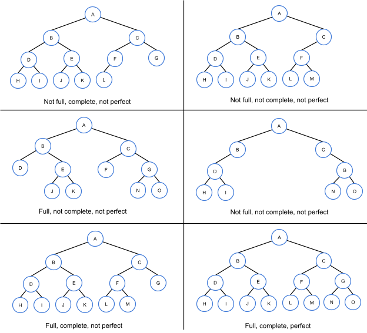
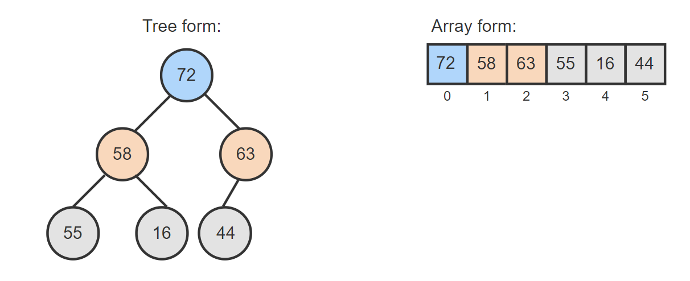
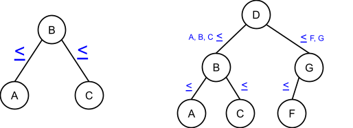
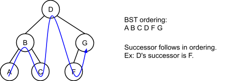

### Tree, binary tree, complete binary tree, full binary tree
* **Tree:** some connected nodes, no limits of the number of children  
* Data structure  


* **Binary tree:** a kind of tree that each node can have at most 2 children  
  **Leaf:** A tree node with no children  
  **Internal node:** A node with at least one child  
  **Parent:** A node with a child is said to be that child's parent. A node's **ancestors** include the node's parent, the parent's parent, etc., up to the tree's root  
  **Root:** The one tree node with no parent  
  **Height:** number of edges to the deepest node (4 in this example)  
  If only a root exists, the height is 0. If the tree is empty, the height can be 0 or -1.  
  
* **Complete binary tree:** nodes are arranged from top to bottom, left to right
* **Full binary tree:** each node has two or no children
* **Perfect binary tree:** complete and full  



### Heap
* A kind of **complete binary tree** that follows specific order.
* Data structure
* **Min heap:** a node's key <= its children's key. **Max heap:** a node's key >= its children's key.  

* **Underlying data structure:** array  

* If the current index is i and the array starts to store data at index 0,  
  **Parent's index:** ⌊i/2⌋  
  **Left child's index:** 2i  
  **Right child's index:** 2i+1  
* **Height:** O(logN)  

### Priority queue
* ADT
* **Backend data structure:** array / linked list
* A queue where each item has a priority, and items with higher priority are closer to the front of the queue than items with lower priority
* **3 ways of implementation:**
  1. Sorted array
     - Insert based on priority sorted order
     - Remove from front
     - enqueue: **O(N)** | dequeue: **O(N)** (or possibly **O(1)** if array is sorted reversely)
  2. Unsorted linked list
     - Insert in front
     - Remove by searching highest-priority item
     - enqueue: **O(1)** | dequeue: **O(N)**
  3. Sorted linked list
     - Insert based on priority sorted order
     - Remove from front
     - enqueue: **O(N)** | dequeue: **O(1)**  

### Binary search tree (BST)
* A kind of **binary tree** that follows specific order.
* Any node's left subtree keys ≤ the node's key, and the right subtree's keys ≥ the node's key.  

* **Successor:** the node that comes after in the BST ordering
* **Predecessor:** the node that comes before in the BST ordering  

* Search:
  ```
  BSTSearch(tree, key) {
     cur = tree.root
     while (cur is not null) {
        if (key == cur.key) {
           return cur // Found
        }
        else if (key < cur.key) {
           cur = cur.left
        }
        else {
           cur = cur.right
        }
     }
     return null // Not found
  }
  ```
* Insert:
  ```
  BSTInsert(tree, node) {
     if (tree.root is null) {
        tree.root = node
     }
     else {
        currentNode = tree.root
        while (currentNode is not null) {
           if (node.key < currentNode.key) {
              if (currentNode.left is null) {
                 currentNode.left = node
                 currentNode = null
              }
              else {
                 currentNode = currentNode.left
              }
           }
           else {
              if (currentNode.right is null) {
                 currentNode.right = node
                 currentNode = null
              }
              else {
                 currentNode = currentNode.right
              }
           }
        }
     }
  }
  ```
* Remove:  
  3 cases: no child, 1 child, 2 children  
  No child: parent's child = null  
  1 child: parent's child = current's child  
  2 children: current's key = successor's key, remove successor
  ```
  BSTRemove(tree, key) {
     par = null
     cur = tree.root
     while (cur is not null) { // Search for node
        if (cur.key == key) { // Node found 
           if (cur.left is null && cur.right is null) { // Remove leaf
              if (par is null) // Node is root
                 tree.root = null
              else if (par.left == cur) 
                 par.left = null
              else
                 par.right = null
           }
           else if (cur.right is null) {                // Remove node with only left child
              if (par is null) // Node is root
                 tree.root = cur.left
              else if (par.left == cur) 
                 par.left = cur.left
              else
                 par.right = cur.left
           }
           else if (cur.left is null) {                // Remove node with only right child
              if (par is null) // Node is root
                 tree.root = cur.right
              else if (par.left == cur) 
                 par.left = cur.right
              else
                 par.right = cur.right
           }
           else {                                      // Remove node with two children
              // Find successor (leftmost child of right subtree)
              suc = cur.right
              while (suc.left is not null)
                 suc = suc.left
              successorData = Create copy of suc's data
              BSTRemove(tree, suc.key)     // Remove successor
              Assign cur's data with successorData
           }
           return // Node found and removed
        }
        else if (cur.key < key) { // Search right
           par = cur
           cur = cur.right
        }
        else {                     // Search left
           par = cur
           cur = cur.left
        }
     }
     return // Node not found
  }
  ```
* Traversal:
  ```
  BSTPrintInorder(node) {
    if (node is null)
        return                     
    BSTPrintInorder(node.left)   
    Print node                     
    BSTPrintInorder(node.right)  
  }
  ```
* Height: *minimal:* O(logN) | *maximum:* O(N)
  ```
  BSTGetHeight(node) {
     if (node is null) {
        return -1
     }
     leftHeight = BSTGetHeight(node⇢left)
     rightHeight = BSTGetHeight(node⇢right)
     return 1 + max(leftHeight, rightHeight)
  }
  ```
* **Runtime complexity:**  
  search: *best case:* O(logN) | *worst case:* O(N)  
  insert: *best case:* O(logN) | *worst case:* O(N)  
