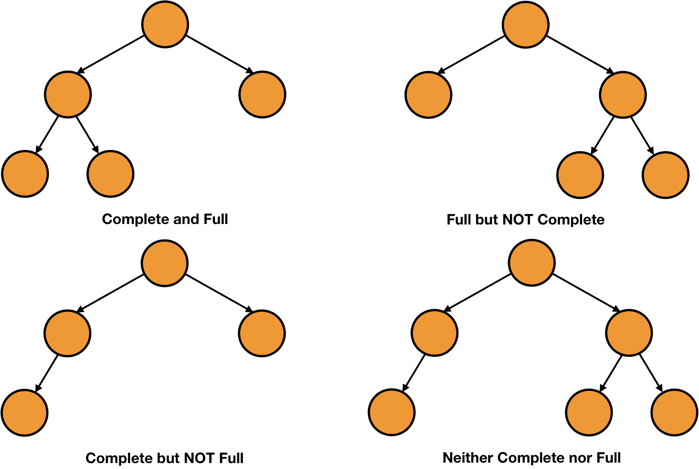
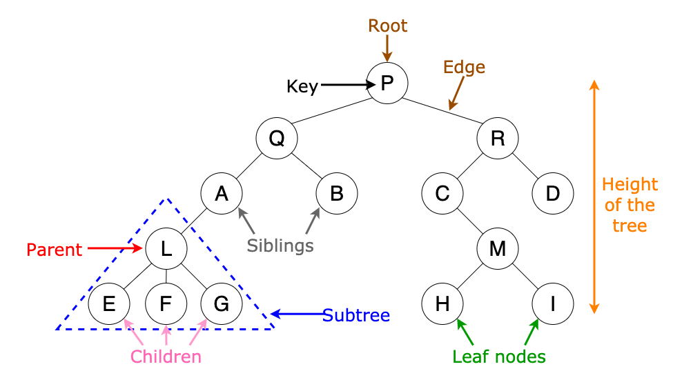

### Tree, binary tree, complete binary tree, full binary tree
* **Tree:** some connected nodes, no limits of the number of children  
* Data structure  

* **Binary tree:** a kind of tree that each node can have at most 2 children  
* **Complete binary tree:** nodes are arranged from top to bottom, left to right
* **Full binary tree:** each node has two or no children
* **Perfect binary tree:** complete and full

* **Leaf:** node that has no child
* **Height:** number of edges to the deepest node (4 in this example)  
  If only a root exists, the height is 0. If the tree is empty, the height can be 0 or -1.  
  

### Heap
* Data structure
* A kind of **complete binary tree** that follows specific order.
* **Min heap:** a node's key <= its children's key. **Max heap:** a node's key >= its children's key.  

* **Storage:** array  

* If the current index is i and the array starts to store data at index 0,  
  **Parent's index:** ⌊i/2⌋  
  **Left child's index:** 2i  
  **Right child's index:** 2i+1  
* **Height:** O(logN)  

### Priority queue
* ADT
* A queue where each item has a priority, and items with higher priority are closer to the front of the queue than items with lower priority
* Methods:
  `Enqueue(PQueue, x)` Inserts x after all equal or higher priority items (sort here)  
  `Dequeue(PQueue)`	Returns and removes the item at the front of PQueue  
