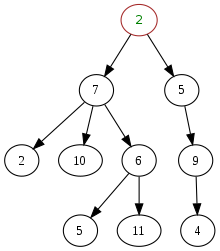

### Tree, binary tree, complete binary tree, full binary tree
* **Tree:** some connected nodes, no limits of the number of children  

* **Binary tree:** a kind of tree that each node can have at most 2 children  
* **Complete binary tree:** nodes are arranged from top to bottom, left to right
* **Full binary tree:** each node has two or no children
* **Perfect binary tree:** complete and full

* **Leaf:** node that has no child
* **Height:** number of edges to the deepest node (4 in this example)  
  If only a root exists, the height is 0. If the tree is empty, the height can be 0 or -1.  
  

### Heap
